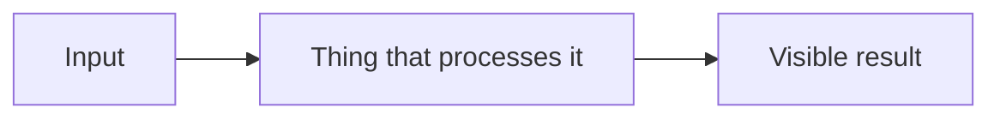

# <Feature name>

<One or two sentences: what this feature does, observable from the outside.>

## The problem it solves

<What the naive version would have looked like and why it was not enough.
Constraints that shaped the solution — the 64x64 render target, performance,
Godot API limits, art direction.>

## Overview

<One paragraph reading the diagram aloud, so the reader can check their
understanding of it.>

## The pieces

| File | Job |
| --- | --- |
| `Scripts/example.gd` | <one line> |
| `Scenes/example.tscn` | <one line, including anything notable in the node tree> |
| `Shaders/example.gdshader` | <one line> |

## How it works

### <Step 1 — named after what happens, not after the file>

<Prose. Cite `Scripts/example.gd:12`. Explain any maths.>

<Where positions carry meaning — an angle, a distance, a buffer layout — script
an SVG into docs/diagrams/ and embed it. Never ASCII art.>

### <Step 2>

<...>

### <Step 3>

<...>

## Decisions and tradeoffs

- **<Decision>** — <what was chosen, what was rejected, why. What it costs.>

## Knobs

| Name | Where | Default | What it does |
| --- | --- | --- | --- |
| `example_strength` | `Scripts/example.gd` export | `0.35` | <effect, useful range> |

## Gotchas

- <Ordering requirement, scene-layout assumption, known limit, or open
  question.>
