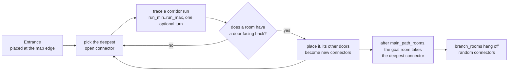

# Dungeon generation

The lunar base is built at runtime from hand-authored room scenes joined by
procedural corridors. You spawn in the entrance at the map edge, work inward to
the command room, and carry the data back out the way you came.

## The problem it solves

The first version scattered rooms at random and then linked them with
pathfinding. That produces islands floating in a void: rooms that share no
walls, corridors that run for twenty metres to reach a neighbour, and doorways
opening onto nothing because only the routes the spanning tree happened to pick
got carved.

The generator now grows outward from doorways instead, the way Unity's DunGen
does. Every corridor starts at a door that already exists and ends where the
next room's door will be, so the base is contiguous by construction and a
doorway can never lead nowhere.

## The pieces

| File | Job |
| --- | --- |
| `Assets/Scripts/Map/dungeon_layout.gd` | The grid. Grows the room graph, carves corridor runs, records doors. No scene knowledge. |
| `Assets/Scripts/Map/dungeon_generator.gd` | Loads room scenes, drives the layout, instances geometry, bakes navigation, places actors |
| `Assets/Scripts/Map/room_slot.gd` | What a room scene's root carries: `tiles` and `role` |
| `Assets/Map/Rooms/` | Seven authored rooms, scanned at runtime |
| `Assets/Map/Corridors/` | Five corridor pieces, chosen by wall mask |

## Growth



A **connector** is an open doorway: a cell outside a room plus the direction it
faces. The main path always extends from the *deepest* connector, which is what
drives the goal room far from the entrance. Branches pick connectors at random,
so they hang off the spine as side wings.

Placement is exact rather than searched. Given a corridor run ending at `tail`
heading in some direction, a candidate room is only usable if it owns a door
whose outward direction is the reverse of that heading; the room's origin then
falls out of the arithmetic (`dungeon_layout.gd:215`):

```gdscript
return tail + STEPS[_last_heading] - door_cell
```

If the room does not fit there the corridor cells carved for the attempt are
rolled back, so a failed attachment leaves no stub behind.

## Roles

`room_slot.gd` exports a `role` StringName. Three values matter:

| Role | Meaning |
| --- | --- |
| `entrance` | Placed first, against the map edge. The player spawns here and returns here. |
| `goal` | Placed last on the main path, at the deepest connector reached. |
| *(empty)* | An ordinary room, eligible for the main path and for branches. |

`Room_Entrance` is 3x6 tiles with a single door on its south edge, which is why
it can only sit against the north edge — rooms are not rotated. `Room_Command`
carries `goal`; the other five are plain.

## Corridor pieces

Piece choice is a **wall mask**, not a corridor shape: for each of the four
sides, a wall is needed unless the neighbour is another corridor cell or the
side is a doorway. The five pieces cover every case up to rotation.

| Walls | Piece |
| --- | --- |
| 0 | `Open` — inside a wide corridor or a junction |
| 1 | `Junction` — the side of a 2-wide run, or a T |
| 2 opposite | `Straight` |
| 2 adjacent | `Corner` |
| 3 | `DeadEnd` |

Because the mask is about walls rather than topology, the same five pieces serve
corridors of any width. A run is widened to two cells with probability
`wide_corridor_chance`, giving 9.2 m halls against 4.2 m service runs.

Walls span `TILE + 2 x thickness` rather than exactly one tile. Stopping at the
tile boundary left a 0.4 x 0.4 m hole at every inside corner where two arms met
diagonally; overlapping into the corner squares fills them, and that zone is
outside the walkable channel on every side so it can never intrude.

## Sight versus collision

Physics layer 1 is world collision. **Layer 5 is "blocks sight"**, and it is
what `vision_field.occluder_mask` and the enemy's `sight_mask` both read.

Walls always carry both layers. A prop carries the sight layer only if it is
**2 m or taller**, so the reactor core, coolant drums, server racks, crates and
the main screen throw vision shadows while tables, counters, consoles, planter
beds and lamp strips do not. Short furniture still blocks movement.

Every room reserves a **3 m walkable ring** inside its walls, so no prop can
seal a doorway. Verified by pathing the baked navmesh between all door pairs.

## Spawning

Actors are found **by group**, not by NodePath. The player group goes to the
centre of the entrance room; the enemy group is scattered over room cells
outside it, each new enemy taking the cell furthest from everything placed so
far.

This replaced an exported list of NodePaths, which silently failed the moment
you duplicated an enemy: the copy was not in the list, so it kept its authored
transform, ended up outside the generated base and fell forever.

## Knobs

On `dungeon_generator.gd`:

| Export | Default | Meaning |
| --- | --- | --- |
| `grid_size` | 28 x 28 | Cells; 28 x 5 m is a 140 m base |
| `tile_size` | 5.0 | Metres per cell. Narrow runs are 4.2 m clear |
| `main_path_rooms` | 5 | Rooms on the spine before the goal |
| `branch_rooms` | 4 | Side rooms hung off random connectors |
| `run_min` / `run_max` | 2 / 6 | Corridor run length in cells |
| `wide_corridor_chance` | 0.7 | Chance a run is doubled to 2 cells wide |
| `agent_radius` | 1.0 | Navigation bake radius; matches the enemy's body |

## Gotchas

**Rooms are never rotated.** A room can only attach where one of its doors
already faces the right way, so a room with a single door is placeable in
exactly one orientation. Give a room doors on opposite sides if you want it to
appear often.

**The entrance is always on the north edge,** because its only door faces south
and rooms do not rotate. Varying that needs room rotation support.

**Room count is best-effort.** `main_path_rooms` and `branch_rooms` are attempt
counts, not guarantees — an extension fails when no candidate room has a door
facing the right way or the space is taken. Six configured rooms typically yield
five or six placed.

**Adding a room is one file.** Drop a `.tscn` into `Assets/Map/Rooms/`, put
`room_slot.gd` on the root, set `tiles`, and add `Marker3D` children under a
`Doors` node. A door's facing comes from whichever room edge its marker sits
nearest, so corner cells are ambiguous — keep markers off the corners.
