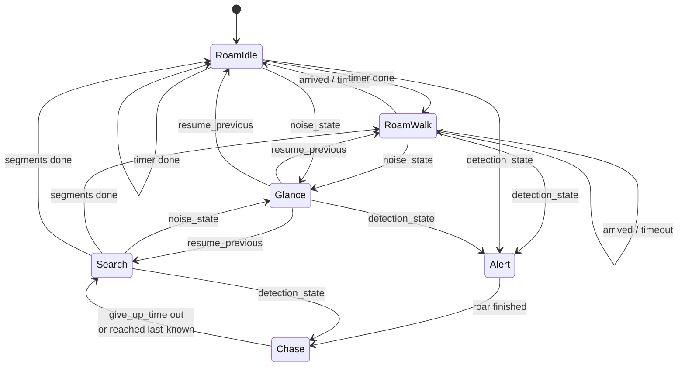
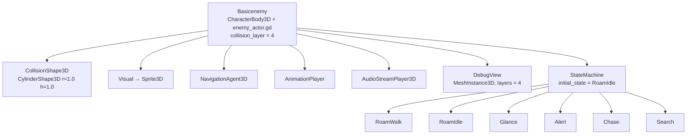
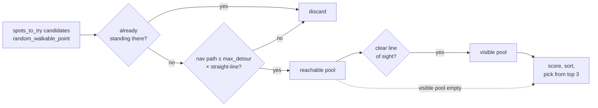
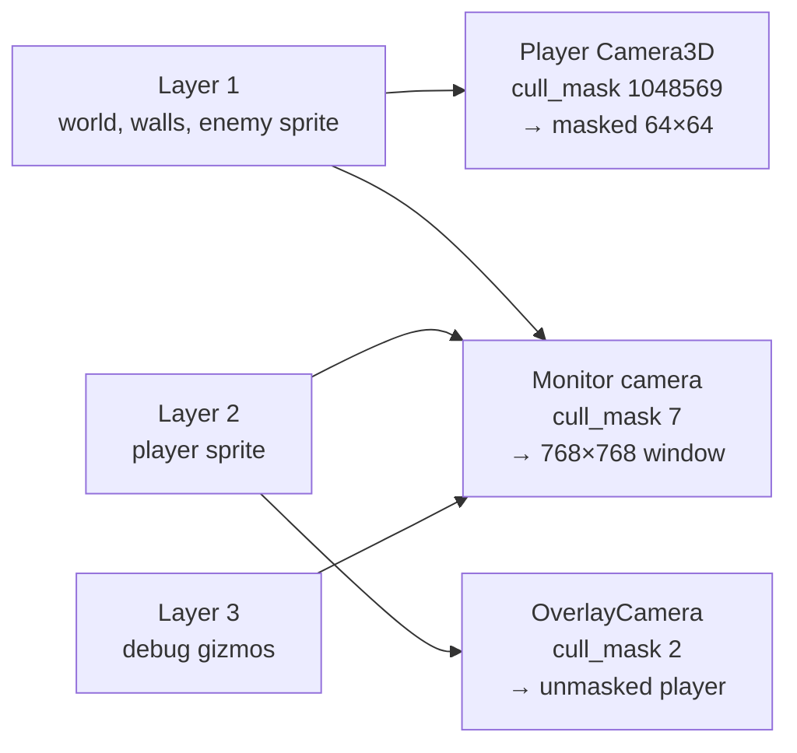

# Enemy AI

An enemy patrols the station on the navmesh, alternating between walking to a
spot it can actually see and standing still. It also *hears* you: move near it
and it may break off to take a suspicious glance in your direction. Stay inside
its sight cone long enough and it stops, roars, then accelerates after you.
Break line of sight and it runs to the last place it saw you, sweeps around that
spot a few times, and drifts back into patrol.

Behaviour is not written in one script. Each state is a **child node** of the
enemy, so a new enemy type is a new scene with a different set of children —
no code changes.

## The problem it solves

The obvious shape for this is an `enum State` and a `match` block in the enemy
script. That works for one enemy. It fails for five, because the states stop
being shared: a stalker that never roars, a sentry that never patrols and a
swarm drone with no search phase all want the same *movement* code and
different *behaviour graphs*. A single match block forces every enemy through
every branch, and tuning values collide — one `chase_speed` export cannot mean
two things.

Splitting the states into nodes moves the behaviour graph out of the code and
into the scene, which is where Godot already lets you compose and override
things per instance. Each state node carries its own exported tuning, so
`Chase.top_speed` on the stalker and on the drone are genuinely separate
values, edited in the inspector, with no code path shared between them.

The second problem is fairness. Detection that fires the instant a pixel of you
enters a cone gives the player nothing to read and no way to peek around a
corner. The dwell timer below fixes that.

The third is that a purely visual enemy is a solved puzzle. Once you know where
the cone points you can walk behind it forever. Hearing adds a channel you
cannot see, and because it only ever produces a *chance* of a glance rather
than a certainty, it makes standing still a real decision instead of a
formality.

The fourth is believability of movement. A roaming enemy that picks a uniformly
random navmesh point commits to paths around corners it has no reason to know
about, and wanders back and forth over the same patch of floor. Scoring the
candidates fixes both.

## The pieces

| File | Job |
| --- | --- |
| `Assets/Scripts/Enemies/enemy_actor.gd` | The body. Senses, hearing, navmesh movement, roam-target choice, turning, animation and audio hooks. Contains no behaviour. |
| `Assets/Scripts/Enemies/enemy_state_machine.gd` | Owns the state nodes, dispatches the tick, runs the detection and noise interrupts |
| `Assets/Scripts/Enemies/enemy_state.gd` | Base state: the `enter`/`exit`/`physics_tick` contract plus the weighted `next_states` roll |
| `Assets/Scripts/Enemies/StateMachine/roam_walk_state.gd` | Walk to a scored, visible point |
| `Assets/Scripts/Enemies/StateMachine/roam_idle_state.gd` | Stand still for a random time |
| `Assets/Scripts/Enemies/StateMachine/glance_state.gd` | Stop and look toward a noise, then resume |
| `Assets/Scripts/Enemies/StateMachine/alert_state.gd` | The roar pause between spotting you and chasing |
| `Assets/Scripts/Enemies/StateMachine/chase_state.gd` | Run at the last known position, accelerating |
| `Assets/Scripts/Enemies/StateMachine/search_state.gd` | Short sweeps around where you were last seen |
| `Assets/Scripts/player.gd` | Exposes `get_noise_level()` — how loud the player currently is |
| `Assets/Scripts/Debug/enemy_debug_view.gd` | Draws the sight cone, state chip, detection meter and nav target |
| `Assets/Scripts/Debug/debug_map_window.gd` | Second OS window showing the whole map, unmasked |
| `Assets/Enemies/BasicEnemy.tscn` | Wires one enemy: state set, per-state tuning, collision layer |
| `Assets/Debug/DebugMapWindow.tscn` | The monitor window node |

## The behaviour graph



The two roam states each list *both* roam states in `next_states`, so the
enemy re-rolls after every trip and can idle twice or walk twice in a row.
There is no forced walk → idle → walk alternation.

`Search` points its `detection_state` at `Chase` rather than `Alert`, so
re-spotting you mid-hunt does not trigger a second roar. That is a per-node
property, not a rule in the code.

`Glance` is the only state that returns to *whatever interrupted it* rather
than to a fixed next state, which is why the machine has a separate
`interrupt_with` / `resume_previous` pair.

## The enemy scene



**The node names are the API.** `initial_state`, `next_states`,
`detection_state`, `noise_state`, `lost_state` and `next_state` are all
`StringName`s matched against child node names in `_states`
(`Assets/Scripts/Enemies/enemy_state_machine.gd:26`). Renaming a state node
breaks every reference to it, and the failure is a `push_warning` at runtime,
not a parse error.

## How it works

### Startup waits for the navmesh

`_ready` disables physics processing immediately
(`Assets/Scripts/Enemies/enemy_actor.gd:67`), collects the child nodes, then
awaits `_wait_for_navigation()` before starting the machine and re-enabling
physics.

This wait is not optional. `NavigationServer3D` answers queries with garbage
until its map has synchronised, and the first roam target would come back as
`Vector3.ZERO` — the enemy walks to the world origin instead of a real
destination. Checking `map_get_iteration_id(map) == 0` is not sufficient on its
own either; it goes non-zero slightly before queries return sane answers. So
`_navigation_is_ready()` (`enemy_actor.gd:118`) additionally asks the map for
the closest point to the enemy's own position and requires it to land within
`NAVIGATION_SNAP_LIMIT` (4.0 m):

```gdscript
return flat_distance(NavigationServer3D.map_get_closest_point(map, global_position), global_position) < NAVIGATION_SNAP_LIMIT
```

That is a direct test of the thing we actually need, rather than a proxy for
it. The loop gives up after `NAVIGATION_WAIT_FRAMES` (120) with a warning.

### Each physics frame

`_physics_process` (`enemy_actor.gd:100`) does six things in order: apply
gravity, update the senses, record the current memory cell, age the memory,
tick the machine, then `move_and_slide()`. States never call `move_and_slide`
themselves — they set `velocity` through the actor's helpers and the actor
commits it once, at the end.

### Sight is a cone plus one ray

`can_see_player()` (`enemy_actor.gd:205`) rejects in three widening steps:
range, then angle, then line of sight. The angle test uses the 2D cross and dot
products of the facing and the direction to the player:

```gdscript
var offset := absf(atan2(facing.x * to_player.y - facing.y * to_player.x, facing.dot(to_player)))
```

`atan2(cross, dot)` gives the signed angle between the two vectors; `absf`
discards the side, leaving the angle off-centre, compared against
`vision_angle_degrees * 0.5`.

Only if both pass does it spend a raycast. The ray is **horizontal**, fired at
the enemy's own eye height toward `Vector3(player.x, eye.y, player.z)` rather
than at the player's eye. Aiming at the player's eye put the ray above the top
of the player's collision box, and it sailed straight over — the enemy could
never see anything. The consequence is that `eye_height` must sit inside the
player's collision box vertically, or detection silently never fires.

The ray must land on the player specifically:

```gdscript
return not hit.is_empty() and hit.collider == _player
```

so a wall between the two is a miss rather than a hit on the wrong body.

### The detection meter


`sight_seconds` accumulates real time while you are visible and drains while
you are not (`enemy_actor.gd:125`):

```gdscript
sight_seconds = minf(sight_seconds + delta, detection_time)
...
sight_seconds = maxf(sight_seconds - delta * detection_decay_rate, 0.0)
```

The rise is 1 second per second and the fall is scaled by
`detection_decay_rate`, so the two are deliberately asymmetric. With the
shipped values (`detection_time = 0.6`, `detection_decay_rate = 3.0` on the
instance in `Scenes/Main.tscn`) it takes 0.6 s of unbroken sight to be spotted
and 0.2 s of cover to reset — punishing, but it still means clipping a corner
for two frames does nothing.

Because it accumulates rather than resetting hard, repeated peeking builds up.

`has_detected_player()` requires *both* the meter to be full and the player to
be visible right now, so detection drops the instant line of sight breaks.
`Chase` does not care, because it opts out of the interrupt entirely.

### Hearing

Hearing runs every frame alongside sight, in `_update_hearing()`
(`enemy_actor.gd:145`). It is deliberately a much cruder sense than vision: no
cone, no exact position, and walls attenuate rather than block.


`get_noise_loudness()` (`enemy_actor.gd:161`) asks the player how loud it is,
scales it by a squared distance falloff, then muffles it if a wall is in the
way:

```gdscript
var reach := 1.0 - distance / hearing_radius
var loudness := output * reach * reach
if _wall_blocks_sound():
    loudness *= wall_muffle
```

The player's contribution is `get_noise_level()` (`Assets/Scripts/player.gd:53`),
which is horizontal speed over `SPEED`, clamped to 0–1. Standing still is
exactly silent, so **the sense only ever reacts to movement**. The squaring is
what makes the falloff feel like proximity rather than a flat radius: at half
the hearing radius you are only a quarter as loud.

`_wall_blocks_sound()` (`enemy_actor.gd:178`) reuses the sight ray but inverts
the success test — a hit on anything *other* than the player means something is
between you, so the sound is muffled:

```gdscript
return not hit.is_empty() and hit.collider != _player
```

That inversion matters. The obvious `has_clear_line_to(player)` always reports
"blocked", because the player's own collider is the first thing the ray hits.

Loudness feeds an accumulator, `noise_level`, which climbs while you are audible
and fades at `noise_fade_rate` when you are not. The accumulator is what turns
into a glance:

```gdscript
if _rng.randf() < glance_rate * noise_level * delta:
    _glance_pending = true
```

Multiplying by `delta` makes `glance_rate` a probability *per second* rather
than per frame, so the behaviour does not change with framerate. Nothing here
is a guarantee — a loud player near the enemy raises the odds, and that is all.

`use_glance()` (`enemy_actor.gd:190`) clears the flag, drops `noise_level` to
30 % of its value, and starts a `glance_cooldown` during which no new glance can
be queued. Without that cooldown the enemy re-glances on the same frame it
resumes: `noise_level` keeps climbing *during* the glance, so it arrives back in
the roam state already over the threshold and locks into a shuffle.

### The glance itself

`Glance.enter()` (`Assets/Scripts/Enemies/StateMachine/glance_state.gd:15`)
plays its sound and picks a facing target from
`guess_noise_spot(max_error_degrees)` (`enemy_actor.gd:196`). That is not the
player's position — it is the direction to the player swung by a random error:

```gdscript
var error := deg_to_rad(max_error_degrees) * (1.0 - clampf(heard_loudness, 0.0, 1.0))
var swung := to.rotated(_rng.randf_range(-error, error))
```

The error shrinks as the heard loudness rises, so a sprint right next to the
enemy points it almost straight at you while a faint noise across the room only
gets it looking roughly the right way. Without this the enemy would turn to your
exact position through a wall, which reads as cheating.

The state then brakes, turns toward that guess for `hold_time`, and calls
`machine.resume_previous()`. It keeps the default `interrupt_on_detection =
true`, so a glance is a genuine opportunity to be caught — that is the point of
the whole mechanic.

### The machine dispatches, and interrupts

`physics_tick` (`enemy_state_machine.gd:74`) is the whole scheduler:

```gdscript
if current.interrupt_on_detection and actor.has_detected_player():
    transition_to(current.detection_state)
elif current.interrupt_on_noise and get_state_name() != current.noise_state and actor.wants_to_glance():
    actor.use_glance()
    if _states.has(current.noise_state):
        interrupt_with(current.noise_state)
current.physics_tick(delta)
```

Four exported properties on every state — `interrupt_on_detection`,
`detection_state`, `interrupt_on_noise` and `noise_state` — are all that decides
how a state reacts to the world. This is why no state needs its own "did I see
or hear the player" check.

Sight wins over sound in the same frame, via the `elif`. The
`get_state_name() != current.noise_state` guard stops `Glance` interrupting
itself into an infinite loop, and `use_glance()` is called even when the target
state is missing so a stale flag cannot wedge the machine.

`interrupt_with` (`enemy_state_machine.gd:57`) is `transition_to` plus a
memory of what it displaced; `resume_previous` (`:64`) goes back there, falling
back to `initial_state` if that state has disappeared. `transition_to` clears
the memory on every ordinary transition, so a glance that escalates into
`Alert` does not later try to rewind into the roam state it came from.

Note that a transition inside the interrupt is followed immediately by
`current.physics_tick(delta)` on the **new** state, in the same frame — `enter()`
has already run by then, so the new state ticks with valid data.

`transition_to` guards against transition loops with `_transition_depth`
against `MAX_CHAINED_TRANSITIONS` (8), for the case where a chain of `enter()`
calls each immediately transitions again.

### Choosing where to roam

`RoamWalk.enter()`
(`Assets/Scripts/Enemies/StateMachine/roam_walk_state.gd:12`) picks a point and,
if it is already close enough, sets `_timer = 0.0` and returns **without
transitioning**. Transitioning from inside `enter()` would recurse — the next
state could be `RoamWalk` again, which could also land on a nearby point.
Deferring by one frame lets `physics_tick` handle it through the normal path.

The point comes from `pick_roam_target()` (`enemy_actor.gd:315`), which
generates `spots_to_try` candidates and filters them twice before scoring:



`random_walkable_point()` (`enemy_actor.gd:302`) supplies each candidate: a
uniform point on a disc snapped to the navmesh.

```gdscript
var reach := sqrt(_rng.randf()) * radius
```

The `sqrt` is what makes it uniform over the disc's *area*. Without it, points
bunch toward the centre, because a disc of radius r has area proportional to r²
so the radius must be distributed as its square root. The snapped result is
rejected if it moved further than `radius`, which catches the enemy standing
off-mesh.

`_path_is_direct()` (`enemy_actor.gd:355`) asks `NavigationServer3D` for the
real path and compares its summed length against the straight-line distance,
rejecting anything longer than `max_detour ×`. This is what stops the enemy
committing to a long walk around a wall to reach somewhere two metres away.

`has_clear_line_to()` (`enemy_actor.gd:227`) is the same horizontal ray as
sight, minus the cone: the enemy only walks to places it can see. Because the
trips are therefore short and re-decided on arrival, it explores by stepping
from vantage point to vantage point rather than gliding along a path it could
not have known about.

`_score_spot()` (`enemy_actor.gd:343`) then ranks the survivors on three terms:

```gdscript
var score := facing_bias * facing.dot(direction)
score -= backtrack_penalty * maxf(_came_from.dot(direction), 0.0)
score -= revisit_penalty * _visit_amount(spot)
```

The first prefers candidates ahead of the enemy, the second penalises turning
back the way it came (`maxf(..., 0.0)` so that only genuine backtracking is
punished, never rewarded), and the third penalises floor it has been on
recently. The winner is not taken outright — the pool is sorted and one of the
top three is picked at random, so the enemy stays biased but not predictable.

### The visit memory

The third scoring term is backed by a dictionary of grid cells.
`_remember_cell()` (`enemy_actor.gd:375`) stamps the cell under the enemy with
`memory_seconds` every physics frame, `_forget_old_cells()` (`:379`) counts
every stamp down by `delta` and erases the expired ones, and `_visit_amount()`
(`:388`) returns the remaining time over `memory_seconds` as a 0–1 weight.

Because the stamp happens every frame rather than only at destinations, the
memory covers the whole *path* walked, not just its endpoints. Cell size is
`memory_cell_size` (2 m), so on the 20×20 floor the dictionary never exceeds a
hundred entries.

Measured over 180 s of roaming, the scored picker covered 70 distinct 2 m cells
against 57 for a plain uniform-random target — about 23 % more ground in the
same time.

### Alert — the roar pause

`Alert` brakes the enemy, turns it to face the last known position, and waits
(`Assets/Scripts/Enemies/StateMachine/alert_state.gd:15`). The interesting line
is the duration:

```gdscript
var animated: float = actor.animation_length(animation)
_timer = animated if animated > 0.0 else default_duration
```

`animation_length()` returns `-1.0` when there is no `AnimationPlayer`, no such
animation, or an empty name. **The pause is timed by the roar animation as soon
as one exists**, and falls back to `default_duration` (1.0 s in the scene)
until then. Dropping a `roar` clip into the `AnimationPlayer` makes the pause
match it with no re-tuning.

The animation and audio hooks are safe to call against the empty
`AnimationPlayer` currently in the scene: `play_animation()` checks
`has_animation` before playing, and both it and `play_sound()` emit signals
(`animation_requested`, `sound_requested`) unconditionally, so VFX or a
separate audio bus can listen before any clip is authored.

### Chase and Search

`Chase` (`Assets/Scripts/Enemies/StateMachine/chase_state.gd:23`) re-points its
destination at `actor.last_known_player_spot` every frame. While you are
visible that value tracks you live; the moment you break sight it goes stale and
the enemy keeps running to where you *were*. That is the whole "lose it around
a corner" behaviour, and it needs no special case — it is just a variable that
stopped updating.

Speed ramps with `move_toward(_speed, top_speed, acceleration * delta)` from
`start_speed`, reset on every `enter()`.

It gives up when `give_up_time` seconds pass without sight, or when it reaches
the stale spot. `Search` then takes that spot as `_search_spot` and runs
`segments_min`–`segments_max` **segments**: one segment is a single short trip
to a point within `radius` of that spot, followed by a `pause_time` stop to look
around. `_start_segment()`
(`Assets/Scripts/Enemies/StateMachine/search_state.gd:41`) also arms
`segment_timeout`, and the segment ends on whichever comes first:

```gdscript
if actor.is_path_finished() or _timer <= 0.0:
```

Normally the arrival wins. The timeout is the safety valve for a point that
turns out to be unreachable or a body wedged against geometry — without it
`is_path_finished()` never becomes true and the enemy would stay in `Search`
forever. It also bounds the whole hunt: with the scene's values that is at most
10 × (2.0 + 0.6) ≈ 26 seconds before it rolls back into the roam states.

Search deliberately calls `random_walkable_point()` rather than
`pick_roam_target()`. When it believes you are nearby, poking at spots it
*cannot* see is exactly the point.

## The debug view

Each enemy carries a `DebugView` `MeshInstance3D` that rebuilds an
`ImmediateMesh` every physics frame: the sight cone (filled and outlined), a
state-coloured chip above the enemy, a line to the current nav target, a white
✕ at the last known player position while alerted, and the detection meter as a
small bar while it is partway.

The cone is **raycast-clipped**, not a flat wedge — it casts
`CONE_SEGMENTS` (24) rays and stops each at the first hit, so what you see is
the region where you would actually be detected, walls included. It uses the
enemy's own `sight_mask` and excludes both the enemy and the player, so the
player's own body cannot carve a notch out of it.

| State | Colour |
| --- | --- |
| RoamWalk | green |
| RoamIdle | blue |
| Glance | magenta |
| Alert | white |
| Chase | red |
| Search | amber |

Unknown state names fall back to `fallback_color` (grey in the scene), which is
how you notice a typo in a `next_states` entry.

Vertices are computed in world space and converted per-vertex with
`to_local()`. An earlier version set `top_level = true` and fed world
coordinates straight in; the parent transform was applied anyway, putting the
cone apex at roughly twice the enemy's position. `to_local()` is correct whether
or not `top_level` applies.

The view draws no hearing state. `noise_level` is a public variable on the
actor, so a bar for it would be a small addition if the sense proves hard to
read in play.

## The monitor window

`F3` toggles the gizmos. They do not appear on the game screen at all — they
render **only** in a second OS window.



`cull_mask = 1048569` is all twenty layers minus bit 1 (the player, value 2) and
bit 2 (the gizmos, value 4). The player is excluded so it can never be masked
by its own vision cone; the gizmos are excluded so debug drawing stays off the
game screen.

The window is a plain `Window` node in `Scenes/Main.tscn`. Three things make it
work:

- It sets `get_tree().root.gui_embed_subwindows = false`. Godot embeds child
  windows by default, which would have drawn the monitor *inside* the 64×64
  viewport.
- It checks its own `World3D` against the root's and adopts the root's if they
  differ, so it renders the same scene rather than an empty one. In the current
  scene tree it already inherits the right world, so this is a guard rather than
  a fix.
- It overrides the camera `Environment` with flat white ambient at
  `ambient_energy`, because the game environment is nearly black and a dark
  debug view is useless.

**No vision mask can reach it.** The mask is a `canvas_item` shader on a
`SubViewportContainer` inside a `CanvasLayer` (see
[the vision cone doc](vision-cone.md)); a separate `Window` has neither, so the
monitor is unmasked by construction rather than by suppression.

It deletes itself when `debug_builds_only` is set and the build is not a debug
build.

## Adding an enemy type

1. Duplicate `Assets/Enemies/BasicEnemy.tscn`.
2. Add, remove or reorder the children of `StateMachine`. A stalker that never
   roars deletes `Alert` and sets the roam states' `detection_state` to
   `Chase`. A deaf sentry deletes `Glance` and clears `interrupt_on_noise`.
3. Retune the exports on each state node.
4. For behaviour that does not exist yet, write a new script extending
   `enemy_state.gd`, override `enter` / `exit` / `physics_tick`, and add it as a
   child.

`enemy_actor.gd` should not need to change. If it does, the new thing probably
belongs there as a shared service (like `move_along_path` or `play_sound`)
rather than in one state.

## Knobs

On the actor (`enemy_actor.gd`), overridable per instance in `Scenes/Main.tscn`:

| Export | Default | Scene value | Meaning |
| --- | --- | --- | --- |
| `vision_angle_degrees` | 70 | 180 | Full cone width, not half |
| `view_distance` | 12 | 10 | Metres, measured horizontally |
| `eye_height` | 0.6 | — | Height of the sight ray. Must intersect the player's collider |
| `sight_mask` | 1 | — | Physics layers that block sight and muffle sound |
| `detection_time` | 0.5 | 0.6 | Seconds of unbroken sight before Alert |
| `detection_decay_rate` | 1.5 | 3.0 | Multiplier on how fast the meter drains |
| `hearing_radius` | 9.0 | — | Metres. Beyond it the player is silent |
| `hearing_sensitivity` | 1.4 | — | How fast loudness fills `noise_level` |
| `wall_muffle` | 0.4 | — | Multiplier when something blocks the ray |
| `noise_fade_rate` | 0.35 | — | How fast `noise_level` drains in silence |
| `glance_rate` | 0.9 | — | Glance chance per second at `noise_level = 1` |
| `glance_cooldown` | 2.0 | — | Seconds before another glance can be queued |
| `turn_speed` | 6.0 | 3.0 | Exponential turn rate |
| `brake_rate` | 14.0 | 10.0 | Deceleration when a state calls `brake()` |
| `arrive_distance` | 0.6 | — | Radius counted as "reached" |
| `spots_to_try` | 12 | 15 | Roam candidates generated per decision |
| `facing_bias` | 1.2 | — | Score bonus for candidates ahead |
| `backtrack_penalty` | 1.6 | — | Score penalty for going back the way it came |
| `revisit_penalty` | 1.1 | — | Score penalty for recently walked floor |
| `roam_needs_line_of_sight` | true | — | Prefer candidates the enemy can see |
| `max_detour` | 1.7 | 1.4 | Reject paths longer than this × straight line |
| `memory_cell_size` | 2.0 | — | Metres per visit-memory cell |
| `memory_seconds` | 45.0 | 30.0 | How long a cell stays "recently visited" |

On the state nodes in `Assets/Enemies/BasicEnemy.tscn`:

| Node | Export | Value |
| --- | --- | --- |
| RoamWalk | `min_speed` / `max_speed` | 1.6 (default) / 3.0 |
| RoamWalk | `radius` / `timeout` | 10.0 / 8.0 (default) |
| RoamWalk | `next_state_weights` | `[0.7, 0.3]` toward walking again |
| RoamIdle | `min_time` / `max_time` | 0.8 / 3.5 (both default) |
| RoamIdle | `next_state_weights` | `[0.8, 0.2]` toward walking |
| Glance | `hold_time` | 0.85 s facing the guess |
| Glance | `max_error_degrees` | 35 (default), scaled down by loudness |
| Glance | `sound` | unset — no clip authored yet |
| Alert | `default_duration` | 1.0 (used only until a `roar` clip exists) |
| Chase | `start_speed` / `top_speed` / `acceleration` | 1.0 / 7.0 / 1.0 |
| Chase | `give_up_time` | 4.0 s (default) without sight before giving up |
| Search | `speed` / `radius` | 3.0 / 2.0 (default) |
| Search | `segments_min` / `segments_max` | 10 / 10 |
| Search | `pause_time` / `segment_timeout` | 0.6 / 2.0 |

On the monitor (`debug_map_window.gd`): `window_size` (768²), `map_centre`,
`map_extent` (21, sized to the 20×20 floor), `render_layers` (7),
`ambient_energy` (1.4), `debug_builds_only`.

## Gotchas

**The enemy body is on collision layer 3** (`collision_layer = 4`), not layer 1.
On layer 1 it registered as an occluder in the player's vision fan and cast a
shadow across its own sprite, so it went half-invisible exactly when you looked
at it. Its `collision_mask` is unchanged, so it still collides with walls.

**Half the floor is not walkable.** The `NavigationMesh` in `Scenes/Main.tscn`
is baked with `agent_radius = 1.0`, matching the enemy's `CylinderShape3D`
radius of 1.0 — a two-metre-wide creature in a 20×20 room with one-metre walls.
Sampling the baked map puts coverage at **51.3 %** of the floor: the bake erodes
a metre off every wall face and off the outer edge, which pinches the gaps
between walls shut. The bake radius is not wrong for that body; the body is
large for that map. Shrinking the collider and re-baking to match is the fix if
the enemy feels boxed in. Note the `NavigationAgent3D.radius` (0.4) is the
avoidance radius and has nothing to do with the bake.

**`roam_needs_line_of_sight` is a preference, not a rule.** If no visible
candidate survives the filters, `pick_roam_target` falls back to the reachable
pool, and if that is empty too it returns a plain random point. Making it strict
would trap the enemy in whichever room it spawned in, because every candidate
past a doorway is occluded.

**`Alert`, `Chase` and `Glance` opt out of noise interrupts in `_init()`,** not
in the inspector. Assigning an inherited `@export` in `_init` works because the
scene only stores properties that differ from the script default, and these are
not stored — but a value set in the inspector *does* win, since scene properties
are applied after `_init`. `Chase` currently has `interrupt_on_noise = false`
in the scene as well, so it is belt and braces there.

**`Testcube` is also on layer 3** (`collision_layer = 4` in `Scenes/Main.tscn`),
so it currently blocks neither enemy sight nor the player's vision shadows.
That is a scene setting, not a code limitation.

**These scripts have no `class_name`.** They type each other through `preload`
consts, and the chain is deliberately one-directional: machine → state → actor.
`enemy_actor.gd` holds its `_machine` reference untyped to keep that chain from
closing into a cycle, which GDScript rejects. If you add `class_name` later,
that constraint goes away — but note that `class_name` needs the editor's global
class registry, so headless runs will not resolve it until the editor has
scanned the project once.

**Untyped members hide typos.** The flip side of the above: `_machine` and
`machine` are untyped, so a misspelled method on them fails at runtime instead
of at parse time. `actor` inside states *is* typed and will catch mistakes.

**Hearing costs a ray per frame per enemy,** on top of the sight ray, and each
roam decision costs up to `spots_to_try` navmesh path queries plus the same
number of rays. Both are cheap for one enemy and worth watching if a crowd ever
shares a room.

**The monitor costs raycasts.** Each enabled `DebugView` fires 24 rays per
physics frame on top of the actor's own sight ray. Fine for one enemy;
turn `enabled` off in the scene before shipping or before spawning many.

**Side effect of the monitor:** setting `gui_embed_subwindows = false` on the
root applies to every child window in the project, not just this one.

**Window placement on one screen.** The monitor tries to sit to the right of the
game window, moves to a second display if one exists, and otherwise clamps
on-screen. With an 832 px game window and a 768 px monitor on a single display
they overlap; drag or resize it.
