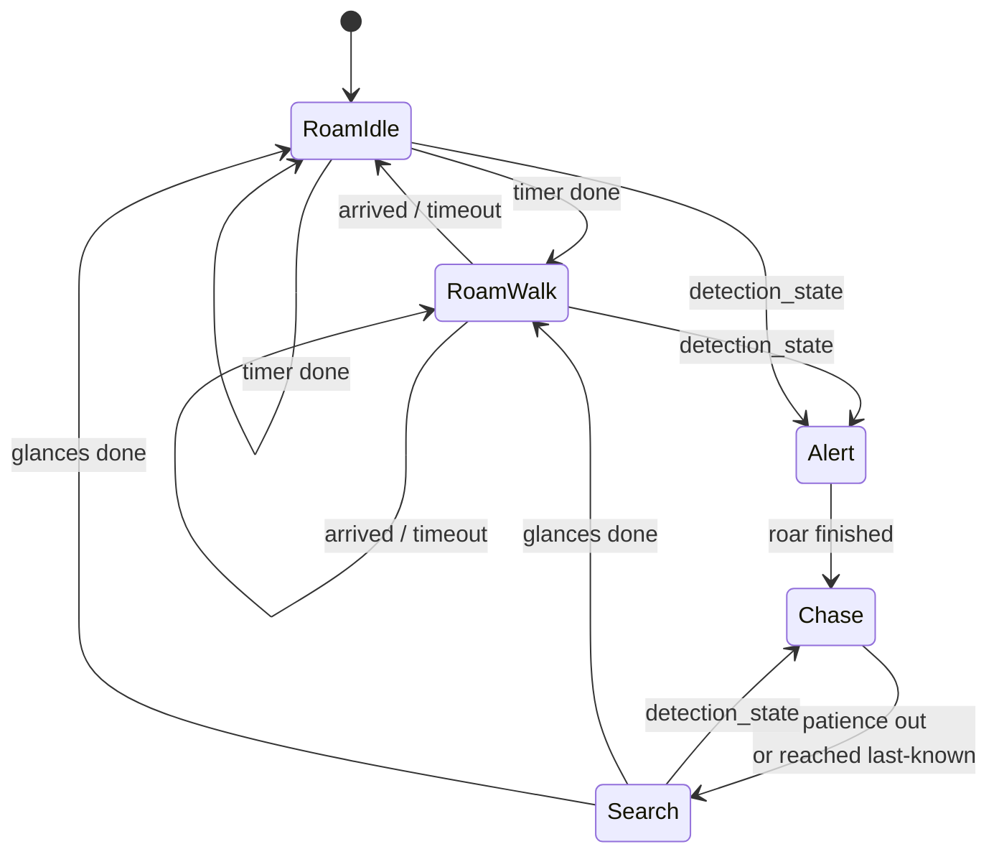
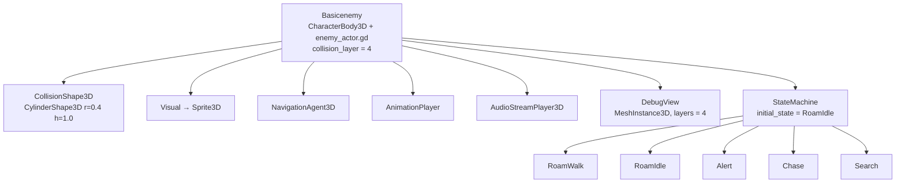
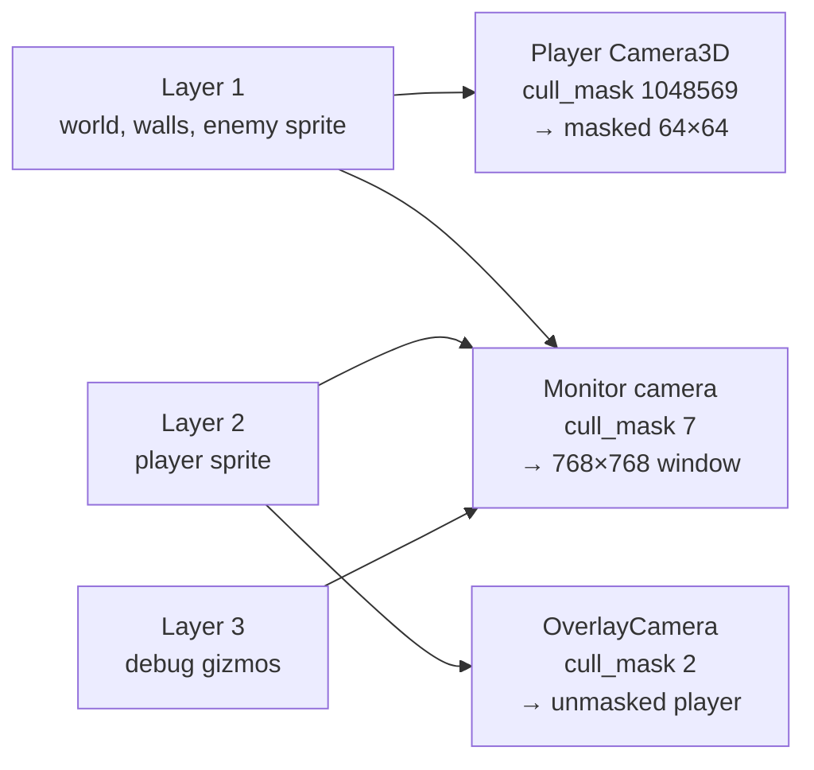

# Enemy AI

An enemy patrols the station on the navmesh, alternating between walking to a
random spot and standing still. When you stay inside its sight cone long enough
it stops, roars, then accelerates after you. Break line of sight and it runs to
the last place it saw you, hunts around that spot a few times, and drifts back
into patrol.

Behaviour is not written in one script. Each state is a **child node** of the
enemy, so a new enemy type is a new scene with a different set of children —
no code changes.

## The problem it solves

The obvious shape for this is an `enum State` and a `match` block in the enemy
script. That works for one enemy. It fails for five, because the states stop
being shared: a stalker that never roars, a sentry that never patrols and a
swarm drone with no search phase all want the same *movement* code and
different *behaviour graphs*. A single match block forces every enemy through
every branch, and tuning values collide — one `chase_speed` export cannot mean
two things.

Splitting the states into nodes moves the behaviour graph out of the code and
into the scene, which is where Godot already lets you compose and override
things per instance. Each state node carries its own exported tuning, so
`Chase.top_speed` on the stalker and on the drone are genuinely separate
values, edited in the inspector, with no code path shared between them.

The second problem is fairness. Detection that fires the instant a pixel of you
enters a cone gives the player nothing to read and no way to peek around a
corner. The dwell timer below fixes that.

## The pieces

| File | Job |
| --- | --- |
| `Assets/Scripts/Enemies/enemy_actor.gd` | The body. Senses, navmesh movement, turning, animation and audio hooks. Contains no behaviour. |
| `Assets/Scripts/Enemies/enemy_state_machine.gd` | Owns the state nodes, dispatches the tick, runs the detection interrupt |
| `Assets/Scripts/Enemies/enemy_state.gd` | Base state: the `enter`/`exit`/`physics_tick` contract plus the weighted `next_states` roll |
| `Assets/Scripts/Enemies/States/roam_walk_state.gd` | Walk to a random reachable point |
| `Assets/Scripts/Enemies/States/roam_idle_state.gd` | Stand still for a random time |
| `Assets/Scripts/Enemies/States/alert_state.gd` | The roar pause between spotting you and chasing |
| `Assets/Scripts/Enemies/States/chase_state.gd` | Run at the last known position, accelerating |
| `Assets/Scripts/Enemies/States/search_state.gd` | Short hops around where you were last seen |
| `Assets/Scripts/Debug/enemy_debug_view.gd` | Draws the sight cone, state chip, detection meter and nav target |
| `Assets/Scripts/Debug/debug_map_window.gd` | Second OS window showing the whole map, unmasked |
| `Assets/Enemies/BasicEnemy.tscn` | Wires one enemy: state set, per-state tuning, collision layer |
| `Assets/Debug/DebugMapWindow.tscn` | The monitor window node |

## The behaviour graph



The two roam states each list *both* roam states in `next_states`, so the
enemy re-rolls after every leg and can idle twice or walk twice in a row.
There is no forced walk → idle → walk alternation.

`Search` points its `detection_state` at `Chase` rather than `Alert`, so
re-spotting you mid-hunt does not trigger a second roar. That is a per-node
property, not a rule in the code.

## The enemy scene



**The node names are the API.** `initial_state`, `next_states`,
`detection_state`, `lost_state` and `next_state` are all `StringName`s matched
against child node names in `_states` (`Assets/Scripts/Enemies/enemy_state_machine.gd:25`).
Renaming a state node breaks every reference to it, and the failure is a
`push_warning` at runtime, not a parse error.

## How it works

### Startup waits for the navmesh

`_ready` disables physics processing immediately
(`Assets/Scripts/Enemies/enemy_actor.gd:42`), collects the child nodes, then
awaits `_navigation_map_ready()` before starting the machine and re-enabling
physics.

This wait is not optional. `NavigationServer3D` answers queries with garbage
until its map has synchronised, and the first roam target would come back as
`Vector3.ZERO` — the enemy walks to the world origin instead of a real
destination. Checking `map_get_iteration_id(map) == 0` is not sufficient on its
own either; it goes non-zero slightly before queries return sane answers. So
`_has_synchronised_navigation_map()` (`enemy_actor.gd:88`) additionally asks the
map for the closest point to the enemy's own position and requires it to land
within `NAVIGATION_SNAP_LIMIT` (4.0 m):

```gdscript
return flat_distance(NavigationServer3D.map_get_closest_point(map, global_position), global_position) < NAVIGATION_SNAP_LIMIT
```

That is a direct test of the thing we actually need, rather than a proxy for
it. The loop gives up after `NAVIGATION_SYNC_FRAMES` (120) with a warning.

### Each physics frame

`_physics_process` (`enemy_actor.gd:72`) does four things in order: apply
gravity, update the senses, tick the machine, then `move_and_slide()`. States
never call `move_and_slide` themselves — they set `velocity` through the actor's
helpers and the actor commits it once, at the end.

### Sensing is a cone plus one ray

`can_see_player()` (`enemy_actor.gd:113`) rejects in three widening steps:
range, then angle, then line of sight. The angle test uses the 2D cross and dot
products of the facing and the direction to the player:

```gdscript
var offset := absf(atan2(facing.x * to_player.y - facing.y * to_player.x, facing.dot(to_player)))
```

`atan2(cross, dot)` gives the signed angle between the two vectors; `absf`
discards the side, leaving the angle off-centre, compared against
`vision_angle_degrees * 0.5`.

Only if both pass does it spend a raycast. The ray is **horizontal**, fired at
the enemy's own eye height toward `Vector3(player.x, eye.y, player.z)` rather
than at the player's eye. Aiming at the player's eye put the ray above the top
of the player's collision box, and it sailed straight over — the enemy could
never see anything. The consequence is that `eye_height` must sit inside the
player's collision box vertically, or detection silently never fires.

The ray must land on the player specifically:

```gdscript
return not hit.is_empty() and hit.collider == _player
```

so a wall between the two is a miss rather than a hit on the wrong body.

### The detection meter


`sight_seconds` accumulates real time while you are visible and drains while
you are not (`enemy_actor.gd:95`):

```gdscript
sight_seconds = minf(sight_seconds + delta, detection_time)
...
sight_seconds = maxf(sight_seconds - delta * detection_decay_rate, 0.0)
```

The rise is 1 second per second and the fall is scaled by
`detection_decay_rate`, so the two are deliberately asymmetric. With the
shipped values (`detection_time = 0.3`, `detection_decay_rate = 3.0` on the
instance in `Scenes/Main.tscn`) it takes 0.3 s of unbroken sight to be spotted
and 0.1 s of cover to reset — punishing, but it still means clipping a corner
for two frames does nothing.

Because it accumulates rather than resetting hard, repeated peeking builds up.

`has_detected_player()` requires *both* the meter to be full and the player to
be visible right now, so detection drops the instant line of sight breaks.
`Chase` does not care, because it opts out of the interrupt entirely.

### The machine dispatches, and interrupts

`physics_tick` (`enemy_state_machine.gd:55`) is the whole scheduler:

```gdscript
if current.interrupt_on_detection and actor.has_detected_player():
    transition_to(current.detection_state)
current.physics_tick(delta)
```

Two exported properties on every state — `interrupt_on_detection` and
`detection_state` — are all that decides how a state reacts to spotting you.
`Alert` and `Chase` set `interrupt_on_detection = false` in the scene so they
run to completion. This is why no state needs its own "did I see the player"
check.

Note that a transition inside the interrupt is followed immediately by
`current.physics_tick(delta)` on the **new** state, in the same frame — `enter()`
has already run by then, so the new state ticks with valid data.

`transition_to` guards against transition loops with `_transition_depth`
against `MAX_CHAINED_TRANSITIONS` (8), for the case where a chain of `enter()`
calls each immediately transitions again.

### The roam states

`RoamWalk.enter()` (`Assets/Scripts/Enemies/States/roam_walk_state.gd:10`) picks
a point and, if it is already close enough, sets `_timer = 0.0` and returns
**without transitioning**. Transitioning from inside `enter()` would recurse —
the next state could be `RoamWalk` again, which could also land on a nearby
point. Deferring by one frame lets `physics_tick` handle it through the normal
path.

`random_navigable_point()` (`enemy_actor.gd:203`) picks a uniform point on a
disc and snaps it to the navmesh:

```gdscript
var reach := sqrt(_rng.randf()) * radius
```

The `sqrt` is what makes it uniform over the disc's *area*. Without it, points
bunch toward the centre, because a disc of radius r has area proportional to r²
so the radius must be distributed as its square root. The snapped result is
rejected if it moved further than `radius`, which catches the enemy standing
off-mesh.

### Alert — the roar pause

`Alert` brakes the enemy, turns it to face the last known position, and waits
(`Assets/Scripts/Enemies/States/alert_state.gd:11`). The interesting line is
the duration:

```gdscript
var animated: float = actor.animation_length(animation)
_timer = animated if animated > 0.0 else fallback_duration
```

`animation_length()` returns `-1.0` when there is no `AnimationPlayer`, no such
animation, or an empty name. **The pause is timed by the roar animation as soon
as one exists**, and falls back to `fallback_duration` (1.0 s in the scene)
until then. Dropping a `roar` clip into the `AnimationPlayer` makes the pause
match it with no re-tuning.

The animation and audio hooks are safe to call against the empty
`AnimationPlayer` currently in the scene: `play_animation()` checks
`has_animation` before playing, and both it and `play_sound()` emit signals
(`animation_requested`, `sound_requested`) unconditionally, so VFX or a
separate audio bus can listen before any clip is authored.

### Chase and Search

`Chase` (`Assets/Scripts/Enemies/States/chase_state.gd:19`) re-points its
destination at `actor.last_known_player_spot` every frame. While you are
visible that value tracks you live; the moment you break sight it goes stale and
the enemy keeps running to where you *were*. That is the whole "lose it around
a corner" behaviour, and it needs no special case — it is just a variable that
stopped updating.

Speed ramps with `move_toward(_speed, top_speed, acceleration * delta)` from
`start_speed`, reset on every `enter()`.

It gives up when `lost_patience` seconds pass without sight, or when it reaches
the stale spot. `Search` then takes that spot as its anchor and makes
`glances_min`–`glances_max` short trips within `radius` of it, pausing at each,
before rolling back into the roam states.

## The debug view

Each enemy carries a `DebugView` `MeshInstance3D` that rebuilds an
`ImmediateMesh` every physics frame: the sight cone (filled and outlined), a
state-coloured chip above the enemy, a line to the current nav target, a white
✕ at the last known player position while alerted, and the detection meter as a
small bar while it is partway.

The cone is **raycast-clipped**, not a flat wedge — it casts
`CONE_SEGMENTS` (24) rays and stops each at the first hit, so what you see is
the region where you would actually be detected, walls included. It uses the
enemy's own `sight_mask` and excludes both the enemy and the player, so the
player's own body cannot carve a notch out of it.

| State | Colour |
| --- | --- |
| RoamWalk | green |
| RoamIdle | blue |
| Alert | white |
| Chase | red |
| Search | amber |

Unknown state names fall back to `fallback_color` (violet), which is how you
notice a typo in a `next_states` entry.

Vertices are computed in world space and converted per-vertex with
`to_local()`. An earlier version set `top_level = true` and fed world
coordinates straight in; the parent transform was applied anyway, putting the
cone apex at roughly twice the enemy's position. `to_local()` is correct whether
or not `top_level` applies.

## The monitor window

`F3` toggles the gizmos. They do not appear on the game screen at all — they
render **only** in a second OS window.



`cull_mask = 1048569` is all twenty layers minus bit 1 (the player, value 2) and
bit 2 (the gizmos, value 4). The player is excluded so it can never be masked
by its own vision cone; the gizmos are excluded so debug drawing stays off the
game screen.

The window is a plain `Window` node in `Scenes/Main.tscn`. Three things make it
work:

- It sets `get_tree().root.gui_embed_subwindows = false`. Godot embeds child
  windows by default, which would have drawn the monitor *inside* the 64×64
  viewport.
- It checks its own `World3D` against the root's and adopts the root's if they
  differ, so it renders the same scene rather than an empty one. In the current
  scene tree it already inherits the right world, so this is a guard rather than
  a fix.
- It overrides the camera `Environment` with flat white ambient at
  `ambient_energy`, because the game environment is nearly black and a dark
  debug view is useless.

**No vision mask can reach it.** The mask is a `canvas_item` shader on a
`SubViewportContainer` inside a `CanvasLayer` (see
[the vision cone doc](vision-cone.md)); a separate `Window` has neither, so the
monitor is unmasked by construction rather than by suppression.

It deletes itself when `debug_builds_only` is set and the build is not a debug
build.

## Adding an enemy type

1. Duplicate `Assets/Enemies/BasicEnemy.tscn`.
2. Add, remove or reorder the children of `StateMachine`. A stalker that never
   roars deletes `Alert` and sets the roam states' `detection_state` to
   `Chase`. A sentry deletes `RoamWalk`.
3. Retune the exports on each state node.
4. For behaviour that does not exist yet, write a new script extending
   `enemy_state.gd`, override `enter` / `exit` / `physics_tick`, and add it as a
   child.

`enemy_actor.gd` should not need to change. If it does, the new thing probably
belongs there as a shared service (like `move_along_path` or `play_sound`)
rather than in one state.

## Knobs

On the actor (`enemy_actor.gd`), overridable per instance in `Scenes/Main.tscn`:

| Export | Default | Scene value | Meaning |
| --- | --- | --- | --- |
| `vision_angle_degrees` | 70 | 160 | Full cone width, not half |
| `view_distance` | 12 | 10 | Metres, measured horizontally |
| `eye_height` | 0.6 | — | Height of the sight ray. Must intersect the player's collider |
| `sight_mask` | 1 | — | Physics layers that block sight |
| `detection_time` | 0.5 | 0.3 | Seconds of unbroken sight before Alert |
| `detection_decay_rate` | 1.5 | 3.0 | Multiplier on how fast the meter drains |
| `turn_speed` | 6.0 | 3.0 | Exponential turn rate |
| `brake_rate` | 14.0 | — | Deceleration when a state calls `brake()` |
| `arrive_distance` | 0.6 | — | Radius counted as "reached" |

On the state nodes in `Assets/Enemies/BasicEnemy.tscn`:

| Node | Export | Value |
| --- | --- | --- |
| RoamWalk | `speed` / `radius` / `timeout` | 1.2 / 10.0 / 8.0 |
| RoamWalk | `next_state_weights` | `[0.7, 0.3]` toward walking again |
| RoamIdle | `minimum_time` / `maximum_time` | 0.8 / 2.0 |
| RoamIdle | `next_state_weights` | `[0.8, 0.2]` toward walking |
| Alert | `fallback_duration` | 1.0 (used only until a `roar` clip exists) |
| Chase | `start_speed` / `top_speed` / `acceleration` | 1.0 / 7.0 / 1.0 |
| Chase | `lost_patience` | 4.0 s without sight before giving up |
| Search | `speed` / `radius` | 3.0 / 2.0 |
| Search | `glances_min` / `glances_max` / `pause` | 3 / 6 / 0.6 |

On the monitor (`debug_map_window.gd`): `window_size` (768²), `map_centre`,
`map_extent` (21, sized to the 20×20 floor), `render_layers` (7),
`ambient_energy` (1.4), `debug_builds_only`.

## Gotchas

**The enemy body is on collision layer 3** (`collision_layer = 4`), not layer 1.
On layer 1 it registered as an occluder in the player's vision fan and cast a
shadow across its own sprite, so it went half-invisible exactly when you looked
at it. Its `collision_mask` is unchanged, so it still collides with walls.

**The collider radius must fit the navmesh bake radius.** The bake radius is not
stored in the `NavigationMesh` resource, but measuring the baked vertices in
`Scenes/Main.tscn` against the wall faces puts it around 0.55 m — so paths hug
walls closer than a wide body can follow. The cylinder is 0.4 m; with the original
1.7 m box the enemy ground itself into a wall corner and stood there for the
full `timeout`. If you re-bake the navmesh with a different agent radius, keep
the collider under it.

**`Testcube` is also on layer 3** (`collision_layer = 4` in `Scenes/Main.tscn`),
so it currently blocks neither enemy sight nor the player's vision shadows.
That is a scene setting, not a code limitation.

**These scripts have no `class_name`.** They type each other through `preload`
consts, and the chain is deliberately one-directional: machine → state → actor.
`enemy_actor.gd` holds its `_machine` reference untyped to keep that chain from
closing into a cycle, which GDScript rejects. If you add `class_name` later,
that constraint goes away — but note that `class_name` needs the editor's global
class registry, so headless runs will not resolve it until the editor has
scanned the project once.

**Untyped members hide typos.** The flip side of the above: `_machine` and
`machine` are untyped, so a misspelled method on them fails at runtime instead
of at parse time. `actor` inside states *is* typed and will catch mistakes.

**The monitor costs raycasts.** Each enabled `DebugView` fires 24 rays per
physics frame on top of the actor's own sight ray. Fine for one enemy;
turn `enabled` off in the scene before shipping or before spawning many.

**Side effect of the monitor:** setting `gui_embed_subwindows = false` on the
root applies to every child window in the project, not just this one.

**Window placement on one screen.** The monitor tries to sit to the right of the
game window, moves to a second display if one exists, and otherwise clamps
on-screen. With an 832 px game window and a 768 px monitor on a single display
they overlap; drag or resize it.
