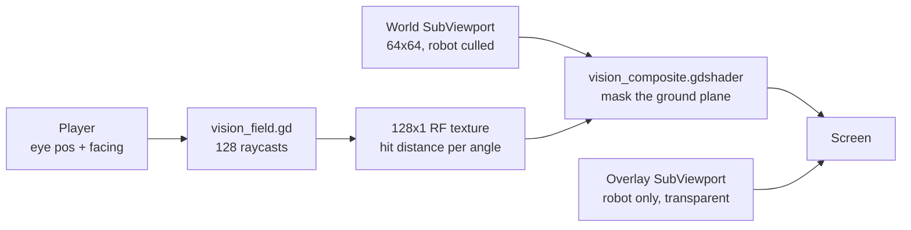
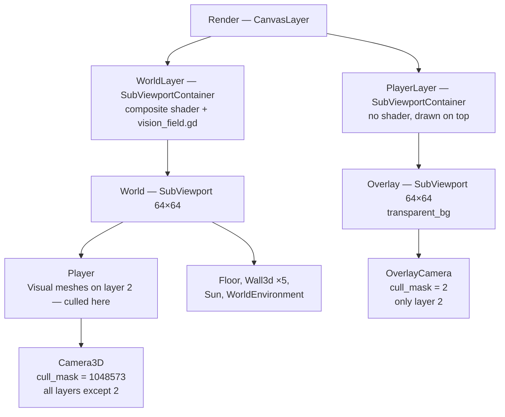
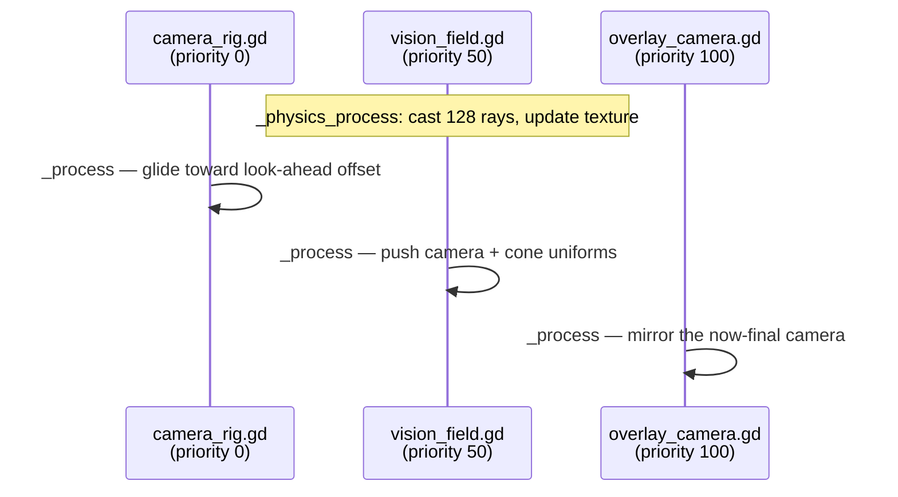

# Raycast vision cone

The robot can only see a wedge of the station in front of it. Everything
outside that wedge — behind it, past its sight range, or hidden around a corner
— is painted flat black. Walls cast real shadows that sweep as the robot turns,
and those shadows soften with distance so a corner blurs rather than snapping.

## The problem it solves

A cone of vision drawn purely in the fragment shader can test "is this pixel
inside the wedge?" cheaply, but it cannot answer "is there a wall between the
robot and this pixel?" — a fragment shader has no access to the scene geometry.
Marching each pixel through the world to find out would mean a raymarch per
pixel per frame.

The trick is that the answer only varies with **angle**. For a given direction
out of the robot's eye, there is exactly one distance at which sight stops. So
the whole visibility problem collapses to a 1D function of angle, which the
physics engine can sample with 128 real raycasts once per physics frame. The
shader then just looks up that function and compares distances.

That is the classic *visibility polygon*, stored as a 128×1 float texture.

## Overview



The world renders into a 64×64 `SubViewport`; the container that displays it
carries the composite shader, so masking happens as a full-screen post pass on
the already-rendered image. The robot is deliberately *not* in that image — it
lives in a second transparent viewport drawn on top, so it can never mask
itself.

## The pieces

| File | Job |
| --- | --- |
| `Scripts/vision_field.gd` | Casts the ray fan, bakes the distance texture, pushes all shader uniforms |
| `Shaders/vision_field.gdshaderinc` | The mask itself — `vision_visibility(uv)` returns 0…1 per pixel |
| `Shaders/vision_composite.gdshader` | Thin wrapper: blends the world image toward `mask_color` by that value |
| `Scripts/overlay_camera.gd` | Copies the game camera's transform and projection into the overlay viewport |
| `Scripts/player.gd` | Owns `facing`, `vision_angle_degrees`, `view_distance`, `get_eye_position()` |
| `Scenes/Main3D.tscn` | Wires the two viewport layers, the render-layer split, and the tuning values |

The mask lives in a `.gdshaderinc` rather than in the composite shader so a
second vision mode is just another shader with the same `#include`.

## How it works

### 1. Fan out the rays

Every physics frame, `_cast_fan()` (`Scripts/vision_field.gd:56`) reads the
robot's eye position and 2D facing vector, then walks 128 evenly spaced angles
across the cone:

```gdscript
var centre := atan2(_eye_dir.x, _eye_dir.y)
var angle := centre - half + (float(i) + 0.5) / float(RAY_COUNT) * 2.0 * half
```

Angles use the convention `atan2(x, z)` — measured from +Z toward +X — which is
why the ray direction is built as `Vector3(sin(angle), 0, cos(angle))` and not
the usual `cos/sin`. The `+ 0.5` puts each ray at the *centre* of its slice
rather than its edge, which is what makes the texel mapping in step 3 line up
exactly.


Each ray is an `intersect_ray` against the physics space. What gets stored is
the **distance**, not the hit point:

```gdscript
_ranges[i] = reach if hit.is_empty() else _eye.distance_to(hit.position) + wall_bleed
```

A miss stores the full `view_distance`, so the cone has a clean rounded outer
edge instead of a gap. `wall_bleed` pushes the recorded distance slightly
*past* the surface that was hit — without it the visibility boundary sits
exactly on the wall's front face, so the face itself falls on the dark side of
the comparison.

The query is built once in `_ready()` with `_query.exclude = [_player.get_rid()]`
(`Scripts/vision_field.gd:39`) so the robot's own collision capsule never
blocks its first ray.

### 2. Bake the distances into a texture

`_bake_image()` reinterprets the `PackedFloat32Array` as raw bytes and wraps it
in a single-channel float image:

```gdscript
Image.create_from_data(RAY_COUNT, 1, false, Image.FORMAT_RF, _ranges.to_byte_array())
```

`FORMAT_RF` is one 32-bit float per texel, which is exactly the memory layout
of a `PackedFloat32Array` — no conversion, just a reinterpretation. The result
is a 128×1 strip where reading left to right sweeps the cone right to left:


The texture is created once and `update()`d in place each physics frame
(`Scripts/vision_field.gd:45`) rather than reallocated on the GPU. It is
sampled with `filter_linear`, so directions falling between two rays get an
interpolated distance — this is what keeps shadow edges from stair-stepping at
only 128 samples.

### 3. Find each pixel's place on the ground plane

The composite shader runs in screen space, so before it can ask "how far is
this pixel from the eye?" it has to get back to world coordinates.
`vision_ground_point()` (`Shaders/vision_field.gdshaderinc:21`) rebuilds the
camera ray from uniforms and intersects it with the ground plane:

```glsl
vec3 origin = cam_pos + cam_right * (ndc.x * cam_half_extents.x)
                      + cam_up    * (ndc.y * cam_half_extents.y);
float t = (ground_height - origin.y) / cam_forward.y;
return (origin + cam_forward * t).xz;
```

This is an *orthographic* unprojection — the offset is applied to the ray's
origin, not its direction, which is only correct because the game camera is
orthographic (`projection = 1`, `size = 10.0`). `_push_camera()` feeds it the
camera's basis vectors and half-extents every frame
(`Scripts/vision_field.gd:77`), so the mask follows the gliding camera rig
without the shader knowing anything about it.

### 4. Compare angle and distance

With a ground point in hand, `vision_visibility()` takes the vector from the
eye to that point and needs its angle *relative to the facing direction*.
Rather than two `atan2` calls and a wrap-around fix, it uses the 2D cross and
dot products directly:

```glsl
float angle = atan(eye_dir.y * to_pixel.x - eye_dir.x * to_pixel.y,
                   dot(eye_dir, to_pixel));
```

For unit vectors the cross term is `sin(p − c)` and the dot is `cos(p − c)`, so
the `atan` returns the signed difference `p − c` in one shot, already wrapped
to −π…π. That value maps straight onto the texture:

```glsl
float u = (angle + half_angle) / (2.0 * half_angle);
```

which puts relative angle −`half_angle` at u = 0 and +`half_angle` at u = 1 —
the exact inverse of the fan in step 1, including the half-texel offset.

The hard visibility test is then one comparison, softened over `shadow_softness`
world units so the boundary is not a hard pixel edge:

```glsl
float hard = 1.0 - smoothstep(traced, traced + fade, dist);
```

### 5. Open a wedge from each silhouette edge

A hard shadow that ends on a knife edge reads as a rendering artefact rather
than as darkness. Real vision lets you see a little *past* a corner, and the
further you stand from the thing casting the shadow the more you get.

That "more with distance" is why the extra vision is measured as an **angle**
and never as a distance. An angular wedge opening from the silhouette corner
widens as it travels, so it draws a triangle; a fixed number of metres would be
a constant-width band hugging the shadow edge, which is what an earlier version
did and why it never looked like anything.

The sweep walks outward in angle from the pixel's own bearing, asking each
direction how lit it is at this exact distance:

```glsl
float angular = 1.0 - smoothstep(0.0, span, offset);
float lit = max(
    1.0 - smoothstep(plus,  plus  + fade, dist),
    1.0 - smoothstep(minus, minus + fade, dist));
unblocked = max(unblocked, angular * lit);
```

`angular` is how much a direction at that offset may contribute, falling to zero
at `silhouette_angle`. `lit` is that direction's own radial fade over
`shadow_softness`. Multiplying them is what keeps the two edges consistent: the
wedge dies into a second occluder through the same softening that governs that
occluder's own shadow, instead of snapping to black.

Two properties fall out of this rather than needing extra code:

- **Re-occlusion is automatic.** The test reads `vision_range_at` for each swept
  direction, so a direction whose ray is stopped short by another wall reports
  as unlit and contributes nothing. The wedge is clipped by the next occluder
  without a second pass.
- **The radial edge is the same expression.** Iteration `i = 0` has `angular` of
  1.0 and `lit` equal to the plain distance fade at the pixel's own bearing, so
  one loop covers both the shadow's near edge and its silhouette.

The cost is that the loop cannot exit early, since the maximum has to be taken
over the whole sweep. It is always `SHADOW_TAPS + 1` iterations with two texture
fetches each, roughly 270k fetches per frame at 64x64.

### 6. Apply the wedge and fade out

Two more falloffs multiply in: `wedge` fades the cone's angular edges over
`edge_softness`, and `in_range` fades the last `distance_fade` metres before
`view_distance`. The composite then blends the rendered world toward black by
whatever is left over:

```glsl
float hidden = (1.0 - vision_visibility(UV)) * mask_color.a;
COLOR = vec4(mix(world, mask_color.rgb, hidden), 1.0);
```

### 7. Keep the robot out of its own shadow

If the robot were in the masked image, the mask would darken it too — its own
sprite sits at distance 0, inside the cone, but the surrounding floor is what
the shader actually samples. Instead the scene splits by render layer:



The robot's `Sprite3D` and mesh are on visual layer 2. The game camera's cull
mask has that one bit cleared, so they never reach the masked image; the
overlay camera's mask is *only* that bit, so it renders the robot and nothing
else onto a transparent background. `overlay_camera.gd` copies the game
camera's transform, projection, size and clip planes every frame so the two
64×64 images register pixel-for-pixel.

The `Headlight` spotlight is on layers 1 **and** 2 (`layers = 3`) so it lights
both halves of the split.

### Frame order



The priorities are load-bearing. `vision_field.gd` sets `process_priority = 50`
and `overlay_camera.gd` sets `100` (`Scripts/overlay_camera.gd:7`), so both run
after the rig has moved the camera for this frame. Reading the camera before it
glides would make the mask lag the image by a frame.

## Decisions and tradeoffs

- **1D visibility texture instead of per-pixel raymarching.** 128 physics
  raycasts per frame regardless of resolution, versus a march per pixel. The
  cost is that visibility is evaluated in a single horizontal plane — see the
  eye-height gotcha below.
- **Raycasts on the physics tick, uniforms on the render tick.** The fan runs
  in `_physics_process` (cheap, fixed rate) while camera and cone uniforms are
  pushed in `_process` (`Scripts/vision_field.gd:48`). The mask geometry can
  therefore be up to one physics step stale while still tracking the camera
  smoothly at render rate.
- **Post-process on a `SubViewportContainer` rather than per-material.** One
  shader masks everything in the scene, including geometry added later, with no
  per-object setup. It also means the mask can only work from the ground plane
  and the final image — it has no depth buffer to consult.
- **Split render layers instead of re-lighting the robot.** Costs a second
  viewport and camera and a second render of one sprite, and requires keeping
  the two cull masks in sync by hand. The alternative — special-casing the
  robot inside the mask function — would fight every future thing that also
  needs to stay visible.
- **32 shadow taps, fixed.** Fully unrolled, always taken, even for pixels
  nowhere near a shadow edge. At 64×64 that is affordable; at a real resolution
  it would want an early-out.

## Knobs

Script exports on `Render/WorldLayer`, with the values `Main3D.tscn` sets:

| Name | Default | In Main3D | What it does |
| --- | --- | --- | --- |
| `wall_bleed` | `0.35` | `0.0` | Metres added to each hit distance, pushing the boundary past the wall face so the face reads as lit. Raise if walls look black-fronted. |
| `edge_softness_degrees` | `3.0` | `10.0` | Angular fade at the two edges of the wedge. |
| `distance_fade` | `1.5` | `1.5` | Metres of fade before `view_distance`. |
| `shadow_softness` | `0.25` | `1.0` | Metres over which a shadow fades in, both at its near edge and where a silhouette wedge dies into another occluder. |
| `silhouette_angle_degrees` | `6.0` | `6.0` | Extra vision past a shadow's silhouette, as an angle from the corner. Widens with distance, so it reads as a triangle. `0` gives hard silhouettes. |
| `mask_color` | black | black | Colour the hidden area is mixed toward. |
| `occluder_mask` | layer 1 | layer 1 | Physics layers the rays collide with. |

On the player (`Scenes/Player3D.tscn`, overridden in `Main3D.tscn`):

| Name | Default | In Main3D | What it does |
| --- | --- | --- | --- |
| `vision_angle_degrees` | `45.0` | `90.0` | Full cone width. Halved into `half_angle` in both the script and the shader. |
| `view_distance` | `7.0` | `20.0` | Sight range, and the value stored for rays that hit nothing. |
| `eye_height` | `1.55` | `2.0` | Height the fan is cast from. |

`RAY_COUNT` (128) and `SHADOW_TAPS` (32) are constants, in `vision_field.gd`
and `vision_field.gdshaderinc` respectively. They are independent — rays are
the resolution of the visibility polygon, taps are the quality of the blur.

## Gotchas

- **Every vision setting lives on the script, in one group.** `_push_cone()`
  overwrites the material's uniforms every frame, so the `ShaderMaterial` used
  to carry a second set of controls that looked live and could never take
  effect. Those duplicate `shader_parameter/` entries are now stripped from
  `Main.tscn`; the only two left on the material, `gradient` and `mix_amount`,
  belong to the tonemap pass rather than to vision. Tune everything on the
  `Render/WorldLayer` node, under the **Player vision** group.
- **Rays are cast at eye height, the mask is evaluated on the floor.** With
  `eye_height = 2.0`, anything shorter than 2 m is invisible to the fan and
  casts no shadow at all, even though it is plainly on the ground. Crates and
  railings will need either a lower fan or their own occluder geometry.
- **Only the ground plane is unprojected.** A pixel showing the top of a wall is
  masked according to the floor position directly beneath it. This holds up
  under the straight-down orthographic camera; it would break immediately if the
  camera were tilted or made perspective, since `vision_ground_point()` assumes
  an orthographic projection.
- **Setup is validated, not enforced.** `_ready()` needs a `SubViewport` as
  child 0, a `ShaderMaterial` on the container, and a node in the `player`
  group; missing any of them logs a warning and disables the script silently
  (`Scripts/vision_field.gd:27`). Likewise `overlay_camera.gd` needs a node in
  the `game_camera` group.
- **The two cull masks must stay in sync by hand.** Anything new that should
  escape the mask has to be on visual layer 2 *and* excluded from the game
  camera's `cull_mask` (currently `1048573` — all 20 layers minus layer 2).
  Setting only one of the two makes the object either double-drawn or invisible.
- **A fresh `Image` is allocated every physics frame.** `_bake_image()` builds a
  new `Image` for each `update()` (`Scripts/vision_field.gd:73`). Harmless at
  128 texels, but it is per-frame garbage if the ray count ever grows.

## The previous shadow model

Kept here so the old look can be restored without unpicking a whole commit. It
lived in `vision_visibility()` in `Assets/Shaders/vision_field.gdshaderinc`.

It blurred visibility by averaging 32 binary taps across an angular window that
grew with depth behind the occluder, then took the larger of that and the plain
radial fade:

```glsl
float fade = max(shadow_softness, 0.0001);
float traced = vision_range_at(angle);
float hard = 1.0 - smoothstep(traced, traced + fade, dist);

float behind = max(dist - traced, 0.0);
float window = min((fade + shadow_spread * behind) / max(dist, 0.001), 2.0 * half_angle);
float step_angle = window / float(SHADOW_TAPS - 1);

float soft = 0.0;
float total_weight = 0.0;
for (int i = 0; i < SHADOW_TAPS; i++) {
    float offset = float(i) - float(SHADOW_TAPS - 1) * 0.5;
    float weight = 1.0 - abs(offset) / (float(SHADOW_TAPS - 1) * 0.5 + 1.0);
    float limit = vision_range_at(angle + offset * step_angle);
    soft += weight * (1.0 - smoothstep(limit, limit + fade, dist));
    total_weight += weight;
}
soft /= total_weight;

float unblocked = max(soft, hard);
```

It needed `uniform float shadow_spread = 0.35;` in the include, an
`@export_range(0.0, 2.0, 0.01) var shadow_spread := 0.35` on
`Assets/Scripts/vision_field.gd`, and a matching
`_material.set_shader_parameter("shadow_spread", shadow_spread)` at the end of
`_push_cone()`.

**To restore only the vision, not whole files:** paste the block above over
everything between `float fade` and `float wedge` inside `vision_visibility()`,
rename the `silhouette_angle` uniform back to `shadow_spread`, and put the
export and the `set_shader_parameter` line back. Nothing else in the project
reads either name, so no other file has to change.

Its two faults, since they are why it went: `max(soft, hard)` leaves a kink
where the two curves cross, so the gradient begins somewhere inside the shadow
rather than at the silhouette and reads as a hard edge however high
`shadow_spread` goes; and the window is measured in metres, so the extra vision
is a constant-width band instead of widening with distance.
