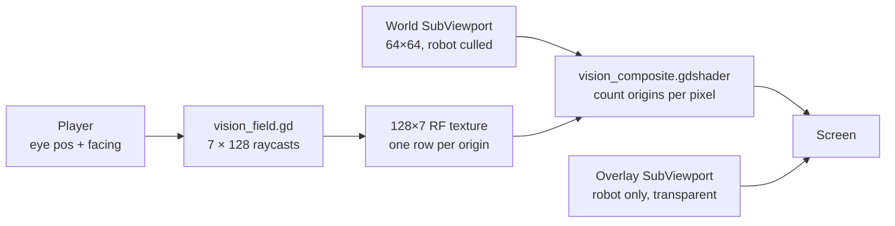
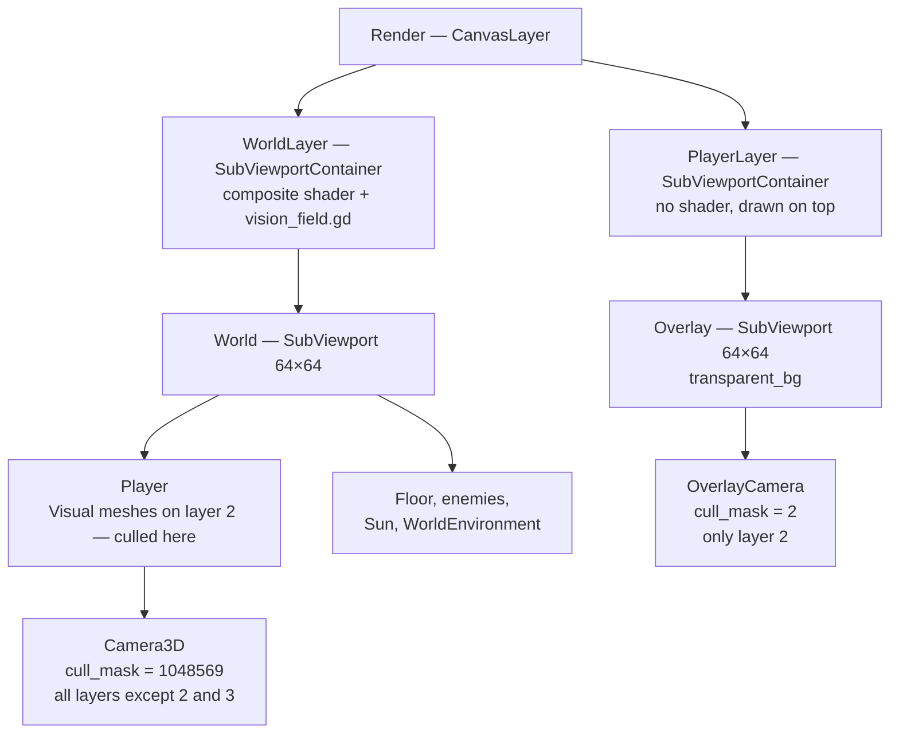
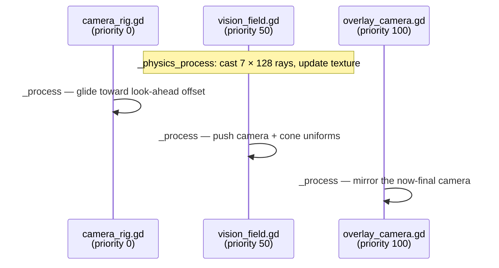

# Raycast vision cone

The robot can only see a wedge of the station in front of it. Everything outside
that wedge — behind it, past its sight range, or hidden around a corner — is
painted flat black. Walls cast real shadows that sweep as the robot turns, and
those shadows have soft edges that widen with distance.

Nothing in the shader blurs them. The eye is a **bar rather than a point**: rays
leave from seven origins spread across the robot's shoulders, and a pixel's
brightness is simply how many of those origins can see it. Umbra, penumbra and
the ability to peek round a corner all fall out of that one fact.

## The problem it solves

A cone of vision drawn purely in the fragment shader can test "is this pixel
inside the wedge?" cheaply, but it cannot answer "is there a wall between the
robot and this pixel?" — a fragment shader has no access to the scene geometry.
Marching each pixel through the world to find out would mean a raymarch per
pixel per frame.

The trick is that from **one** point, the answer only varies with angle. For a
given direction out of a given origin, there is exactly one distance at which
sight stops, so visibility collapses to a 1D function of angle that the physics
engine can sample with real raycasts. That is the classic *visibility polygon*.

An area light is then just that trick repeated. Seven origins give seven
visibility polygons, stored as the seven rows of a 128×7 float texture, and the
shader asks each of them the same question about the same pixel.

## Overview



The world renders into a 64×64 `SubViewport`; the container that displays it
carries the composite shader, so masking happens as a full-screen post pass on
the already-rendered image. The robot is deliberately *not* in that image — it
lives in a second transparent viewport drawn on top, so it can never mask
itself.

## The pieces

| File | Job |
| --- | --- |
| `Assets/Scripts/vision_field.gd` | Casts the fans, bakes the range texture, pushes every shader uniform |
| `Assets/Shaders/vision_field.gdshaderinc` | The mask itself — `vision_visibility(uv)` returns 0…1 per pixel |
| `Assets/Shaders/vision_composite.gdshader` | Blends the world image toward `mask_color`, then maps it through the palette gradient |
| `Assets/Scripts/overlay_camera.gd` | Copies the game camera's transform and projection into the overlay viewport |
| `Assets/Scripts/player.gd` | Owns `facing`, `vision_angle_degrees`, `view_distance`, `get_eye_position()` |
| `Scenes/Main.tscn` | Wires the two viewport layers, the render-layer split, and the tuning values |

The mask lives in a `.gdshaderinc` rather than in the composite shader so a
second vision mode is just another shader with the same `#include`.

## How it works

### 1. Place the origins

`_cast_fan()` (`Assets/Scripts/vision_field.gd:68`) builds a right vector by
rotating `facing` 90°, then spaces `ORIGIN_COUNT` origins evenly along it,
centred on the robot's eye:

```gdscript
_eye_right = Vector2(_eye_dir.y, -_eye_dir.x)
var origin := _eye + right * (_origin_offset(k) * aperture_width)
```

`_origin_offset()` returns −0.5…+0.5, so with an odd count the middle origin sits
exactly on the eye. The bar is perpendicular to facing and turns with the robot,
so the aperture is always presented broadside to whatever is being looked at.


### 2. Fan out the rays

Each origin walks `RAY_COUNT` evenly spaced angles:

```gdscript
var angle := centre - fan_half + (float(i) + 0.5) / float(RAY_COUNT) * 2.0 * fan_half
```

Angles use the convention `atan2(x, z)` — measured from +Z toward +X — which is
why the ray direction is built as `Vector3(sin(angle), 0, cos(angle))` and not
the usual `cos/sin`. The `+ 0.5` puts each ray at the *centre* of its slice
rather than its edge, which is what makes the texel mapping in step 5 line up
exactly.

Every fan spans the **same absolute angles**, centred on facing rather than on
its own origin. That is what lets all seven share one texture with a single `u`
mapping. It also means each fan has to reach wider than the authored cone: an
origin 0.7 m off-centre sees a pixel 2 m away at a bearing roughly 20° from where
the centre origin sees it, and without that headroom the lookup would run off the
end of the row. `fan_margin_degrees` is that headroom
(`Assets/Scripts/vision_field.gd:90`).

What gets stored is the **distance**, not the hit point, and it is measured from
*that origin*:

```gdscript
_ranges[row + i] = reach if hit.is_empty() else origin.distance_to(hit.position) + wall_bleed
```

A miss stores the full `view_distance`, so the cone has a clean rounded outer
edge instead of a gap. `wall_bleed` pushes the recorded distance slightly *past*
the surface that was hit — without it the visibility boundary sits exactly on the
wall's front face, so the face itself falls on the dark side of the comparison.

The query is built once in `_ready()` with `_query.exclude = [_player.get_rid()]`
(`Assets/Scripts/vision_field.gd:45`) so the robot's own collider never blocks
its first ray.

### 3. Bake the rows into a texture

`_bake_image()` reinterprets the `PackedFloat32Array` as raw bytes and wraps it
in a single-channel float image:

```gdscript
Image.create_from_data(RAY_COUNT, ORIGIN_COUNT, false, Image.FORMAT_RF, _ranges.to_byte_array())
```

`FORMAT_RF` is one 32-bit float per texel, which is exactly the memory layout of
a `PackedFloat32Array` — no conversion, just a reinterpretation. Origin `k`
occupies the contiguous slice `_ranges[k * RAY_COUNT .. k * RAY_COUNT + 127]`,
which lands as row `k`.


That drift is the entire effect. Where the rows agree, every origin sees the same
thing and the pixel is fully lit or fully dark. Where they disagree, the pixel is
in penumbra.

The texture is created once and `update()`d in place each physics frame
(`Assets/Scripts/vision_field.gd:51`) rather than reallocated on the GPU.

### 4. Find each pixel's place on the ground plane

The composite shader runs in screen space, so before it can ask "how far is this
pixel from an origin?" it has to get back to world coordinates.
`vision_ground_point()` (`Assets/Shaders/vision_field.gdshaderinc:25`) rebuilds
the camera ray from uniforms and intersects it with the ground plane:

```glsl
vec3 origin = cam_pos + cam_right * (ndc.x * cam_half_extents.x)
                      + cam_up    * (ndc.y * cam_half_extents.y);
float t = (ground_height - origin.y) / cam_forward.y;
return (origin + cam_forward * t).xz;
```

This is an *orthographic* unprojection — the offset is applied to the ray's
origin, not its direction, which is only correct because the game camera is
orthographic (`projection = 1`). `_push_camera()` feeds it the camera's basis
vectors and half-extents every frame (`Assets/Scripts/vision_field.gd:99`), so
the mask follows the gliding camera rig without the shader knowing anything about
it.

### 5. Ask one origin whether it sees the pixel

`vision_origin_sees()` (`Assets/Shaders/vision_field.gdshaderinc:48`)
reconstructs origin `k` from the same arithmetic the script used, takes the
vector from it to the pixel, and needs that vector's angle *relative to facing*.
Rather than two `atan2` calls and a wrap-around fix, it uses the 2D cross and dot
products directly:

```glsl
return atan(eye_dir.y * direction.x - eye_dir.x * direction.y,
            dot(eye_dir, direction));
```

For unit vectors the cross term is `sin(p − c)` and the dot is `cos(p − c)`, so
the `atan` returns the signed difference in one shot, already wrapped to −π…π.

Then comes the per-fan angle constraint:

```glsl
if (abs(angle) > fan_half_angle) {
    return 0.0;
}
```

An out-of-fan pixel reports **not seen**, rather than clamping `u` to the end of
the row and reading a range that belongs to a completely different bearing. This
is the one place the model can quietly go wrong, and it is why the check is a
hard early-out rather than a `clamp`.

Otherwise it maps the angle onto the row and compares:

```glsl
float u = (angle + fan_half_angle) / (2.0 * fan_half_angle);
float v = (float(index) + 0.5) / float(count);
float traced = texture(vision_ranges, vec2(u, v)).r;
return 1.0 - smoothstep(traced, traced + max(shadow_softness, 0.0001), dist);
```

`u` is the exact inverse of the fan in step 2, including the half-texel offset.
`v` lands on a row centre, which matters: the sampler is `filter_linear`, and
blending origin 3's range with origin 4's range would be meaningless. Hitting the
centre exactly means the vertical filter returns one row untouched while the
horizontal filter still interpolates between adjacent rays, which is what keeps
shadow edges from stair-stepping at only 128 samples.

### 6. Count the origins

`vision_visibility()` (`Assets/Shaders/vision_field.gdshaderinc:67`) is then just
an average:

```glsl
int count = textureSize(vision_ranges, 0).y;
for (int i = 0; i < count; i++) {
    unblocked += vision_origin_sees(point, i, count);
}
unblocked /= float(count);
```


Three things come out of this for free:

- **Umbra and penumbra are geometric.** A pixel hidden from every origin is
  black; one hidden from three of seven is 4⁄7 lit. There is no softening term
  to tune, and the penumbra widens with distance because the origins' shadows
  diverge — not because anything was told to widen.
- **Thin props stop casting.** An occluder narrower than the aperture loses its
  umbra entirely past `b = W·a / (W − O)`, where `W` is the aperture, `O` the
  occluder width and `a` its distance. At the current 1.4 m aperture a 0.4 m
  crate 4 m away casts full shadow only to 5.6 m and is a smudge beyond that.
  This is the main gameplay consequence of the knob.
- **Corner peeking works.** Standing at a corner, the outboard origins genuinely
  see past it while the centre one does not, so a sliver of the far side lights
  up as the robot edges out. This is the point of the whole model, not a side
  effect.

### 7. Apply the wedge and fade out

The cone itself is measured from the **centre** eye only, so its shape stays
authored rather than softening with aperture: `wedge` fades the angular edges
over `edge_softness`, and `in_range` fades the last `distance_fade` metres before
`view_distance`. The composite then blends the rendered world toward `mask_color`
and maps the result through the palette gradient
(`Assets/Shaders/vision_composite.gdshader:17`):

```glsl
float hidden = (1.0 - vision_visibility(UV)) * mask_color.a;
vec4 input_color = vec4(mix(world, mask_color.rgb, hidden), 1.0);
float greyscale_value = dot(input_color.rgb, vec3(0.299, 0.587, 0.114));
COLOR.rgb = mix(input_color.rgb, texture(gradient, vec2(greyscale_value, 0.0)).rgb, mix_amount);
```

`mix_amount` is `0.0` in `Main.tscn`, so the gradient pass is wired but inert
until the palette is settled.

### 8. Keep the robot out of its own shadow

If the robot were in the masked image, the mask would darken it too — its own
sprite sits at distance 0, inside the cone, but the surrounding floor is what the
shader actually samples. Instead the scene splits by render layer:



The robot's `Sprite3D` and mesh are on visual layer 2. The game camera's cull
mask has that bit cleared, so they never reach the masked image; the overlay
camera's mask is *only* that bit, so it renders the robot and nothing else onto a
transparent background. `overlay_camera.gd` copies the game camera's transform,
projection, size and clip planes every frame so the two 64×64 images register
pixel-for-pixel.

Enemies are deliberately **not** given that exemption. They live in the masked
image, so an enemy standing in the dark is genuinely invisible.

The `Headlight` spotlight is on layers 1 **and** 2 (`layers = 3`) so it lights
both halves of the split.

### Frame order



The priorities are load-bearing. `vision_field.gd` sets `process_priority = 50`
and `overlay_camera.gd` sets `100`, so both run after the rig has moved the
camera for this frame. Reading the camera before it glides would make the mask
lag the image by a frame.

## Decisions and tradeoffs

- **An area light instead of a softening term.** The previous model faked the
  penumbra with a 33-iteration angular sweep and a tunable width. This one has no
  softness parameter at all; the look is controlled by a physical width in
  metres. The cost is that the CPU now casts seven times as many rays.
- **Cost moved from the GPU to the physics engine.** The old sweep did about 66
  texture fetches per pixel, roughly 270k per frame at 64×64. This does seven,
  about 29k — a ninefold saving — while raycasts went from 128 to 896 per physics
  tick. That trade is only obviously correct at this resolution.
- **`ORIGIN_COUNT` lives only in the script.** The shader reads its loop bound
  from `textureSize(vision_ranges, 0).y` instead of a matching `const`. A shader
  constant and a script constant that must agree is a silent-desync waiting to
  happen: the mask would still render, just subtly wrong. The price is a loop the
  compiler cannot unroll, which at 4096 pixels × 7 is nothing.
- **The wedge is measured from the centre origin.** The cone's angular edges stay
  crisp and authored via `edge_softness_degrees`, rather than softening as a side
  effect of the aperture. The cone is a camera property; the aperture is a light
  property.
- **Origins are never clamped against geometry.** They do not need to be — see
  the aperture invariant below.
- **1D visibility rather than per-pixel raymarching.** Raycast count is
  independent of resolution. The cost is that visibility is evaluated in a single
  horizontal plane — see the eye-height gotcha.
- **Post-process on a `SubViewportContainer` rather than per-material.** One
  shader masks everything in the scene, including geometry added later, with no
  per-object setup. It also means the mask can only work from the ground plane
  and the final image — it has no depth buffer to consult.

## Knobs

Script exports on `Render/WorldLayer`, under the **Player vision** group, with
the values `Main.tscn` sets:

| Name | Default | In Main | What it does |
| --- | --- | --- | --- |
| `aperture_width` | `0.6` | `1.4` | Width of the origin bar in metres. **The knob.** `0` collapses to a point light and hard shadows; wider softens everything and stops thin props casting. |
| `fan_margin_degrees` | `15.0` | `45.0` | How far past the cone each fan reaches, so off-centre origins can still resolve pixels near the cone edge. Too low and pixels close to the robot lose their outboard origins and darken. |
| `shadow_softness` | `0.05` | `1.0` | Metres of radial fade on each origin's own shadow. No longer the soft-shadow control — with an area light its job is antialiasing the individual steps. `0` gives a hard stair. |
| `wall_bleed` | `0.35` | `0.0` | Metres added to each hit distance, pushing the boundary past the wall face so the face reads as lit. Raise if walls look black-fronted. |
| `edge_softness_degrees` | `3.0` | `13.0` | Angular fade at the two edges of the wedge. |
| `distance_fade` | `1.5` | `10.0` | Metres of fade before `view_distance`. |
| `mask_color` | black | black | Colour the hidden area is mixed toward. |
| `occluder_mask` | layer 1 | layer 5 | Physics layers the rays collide with. Layer 5 is the dedicated sight layer: walls always block, props only if they are 2 m or taller. |

On the player (`Assets/Player/Player.tscn`, overridden in `Main.tscn`):

| Name | Default | In Main | What it does |
| --- | --- | --- | --- |
| `vision_angle_degrees` | `45.0` | `110.0` | Full cone width. Halved into `half_angle` in both the script and the shader. |
| `view_distance` | `7.0` | `20.0` | Sight range, and the value stored for rays that hit nothing. |
| `eye_height` | `1.55` | `1.0` | Height the fans are cast from. |

On the material, under **GradientMapping**: `gradient` and `mix_amount`. These
are the only two shader parameters the script does not overwrite.

`RAY_COUNT` (128) and `ORIGIN_COUNT` (7) are constants at the top of
`vision_field.gd`. They are independent — rays are the angular resolution of each
visibility polygon, origins are the number of penumbra steps.

## Gotchas

- **Every vision setting lives on the script, in one group.** `_push_cone()`
  overwrites the material's uniforms every frame, so anything you type into the
  material's Shader Parameters list is inert — and Godot writes it back into
  `Main.tscn`, so it looks saved and still does nothing. The uniforms are grouped
  under **NoTouchy** in the inspector to say so. Tune on the `Render/WorldLayer`
  node instead.
- **The aperture invariant.** Origins are never checked against geometry, because
  the player's `BoxShape3D` is scaled 1.4 in X and Z — half-width 0.7 m — so
  nothing can come within 0.7 m of the robot's centre. Any aperture up to 1.4 m
  therefore keeps all seven origins inside the player's own footprint and in free
  space. `MAX_APERTURE_WIDTH` pins the export range to that. **Shrink the player's
  collider and this breaks**: an origin buried in a wall reports everything
  blocked, and hugging a wall would dim the whole screen by 1⁄7.
- **Rays are cast at eye height, the mask is evaluated on the floor.** With
  `eye_height = 1.0`, anything shorter than 1 m is invisible to the fans and casts
  no shadow at all, even though it is plainly on the ground.
- **Only the ground plane is unprojected.** A pixel showing the top of a wall is
  masked according to the floor position directly beneath it. This holds up under
  the straight-down orthographic camera; it would break immediately if the camera
  were tilted or made perspective.
- **Setup is validated, not enforced.** `_ready()` needs a `SubViewport` as child
  0, a `ShaderMaterial` on the container, and a node in the `player` group;
  missing any of them logs a warning and disables the script silently
  (`Assets/Scripts/vision_field.gd:33`). Likewise `overlay_camera.gd` needs a node
  in the `game_camera` group.
- **The two cull masks must stay in sync by hand.** Anything new that should
  escape the mask has to be on visual layer 2 *and* excluded from the game
  camera's `cull_mask` (currently `1048569` — all 20 layers minus 2 and 3, where 3
  is the debug gizmo layer). Setting only one of the two makes the object either
  double-drawn or invisible.
- **A fresh `Image` is allocated every physics frame.** `_bake_image()` builds a
  new `Image` for each `update()`. It is now 896 floats rather than 128, so this
  is eight times the per-frame garbage it used to be.

## The previous shadow model

Kept here so the old look can be restored without unpicking a whole commit. It
lived in `vision_visibility()` in `Assets/Shaders/vision_field.gdshaderinc`, cast
from a single origin, and opened an angular wedge from each silhouette edge:

```glsl
float fade = max(shadow_softness, 0.0001);
float span = min(silhouette_angle, 2.0 * half_angle);
float step_angle = span / float(SHADOW_TAPS);

float unblocked = 0.0;
for (int i = 0; i <= SHADOW_TAPS; i++) {
    float offset = step_angle * float(i);
    float angular = 1.0 - smoothstep(0.0, span, offset);
    float plus = vision_range_at(angle + offset);
    float minus = vision_range_at(angle - offset);
    float lit = max(
        1.0 - smoothstep(plus, plus + fade, dist),
        1.0 - smoothstep(minus, minus + fade, dist));
    unblocked = max(unblocked, angular * lit);
}
```

It needed `const int SHADOW_TAPS = 32;` and `uniform float silhouette_angle`, a
`vision_range_at()` helper that sampled a 128×1 texture at `v = 0.5`, an
`@export_range(0.0, 45.0, 0.5) var silhouette_angle_degrees := 6.0`, and a
matching `set_shader_parameter` in `_push_cone()`.

Its fault, since that is why it went: the extra vision was invented rather than
traced. It widened with distance and clipped correctly against second occluders,
but it came from *one* origin, so it could only ever guess at what a wider eye
would have seen. It could not peek round a corner, because there was nothing off
to the side to do the peeking — which is exactly what the aperture model is for.
